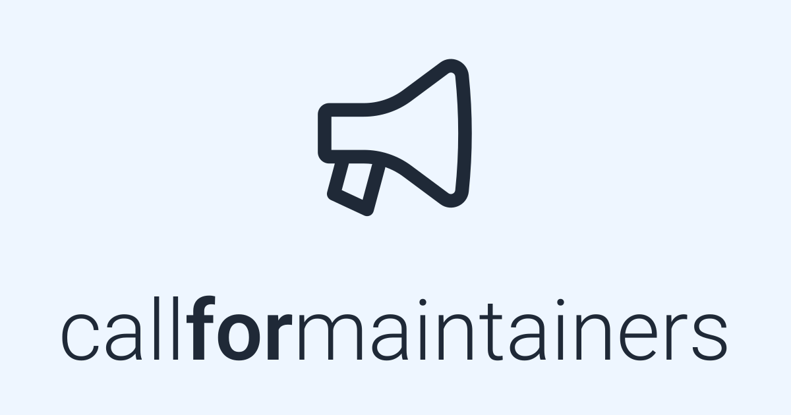

<h1 align="center">
	<a href="https://callformaintainers.org/"></a>
</h1>

> A public list of projects looking for additional maintainers. See at: https://callformaintainers.org/

## Submitting a new project

All projects are kept in the same repository as this website as JSON files. There are some scripts to make your life easier and following the instructions above should do the trick.

1. Clone your fork locally
```
git clone "git@github.com:YOUR_NAME/call-for-maintainers.git"
```
2. Install dependencies
```
cd call-for-maintainers
npm install
```

3. Run the script that fetches your repo
```
./scripts/fetch-repo.js OWNER/REPO
```

4. If you have a PR with details about becoming maintainer set it in the `moreLink` property in the JSON file
```
vi src/projects/OWNER/REPO.json
```

5. Run the script that generates the index
```
./scripts/build-index.js
```

6. Commit your changes
```
git add -a .
git commit -m "Added OWNER/REPO"
```

7. Push your changes and create a PR
```
git push
```

## Developing

This project was done with [Svelte]() and [SvelteKit]().
After checking out, install dependencies and start the development server:

```bash
npm install
npm run dev

# or start the server and open the app in a new browser tab
npm run dev -- --open
```